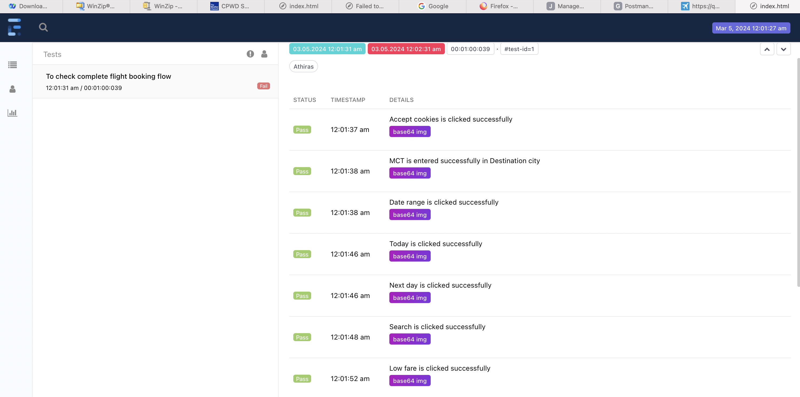

## Abstract Idea about the task:
Automation testing task (UI)

Resource: Fly Dubai

Using the Selenium with base language Java, please create a test with the convenient framework structure for flight booking:

# selenium-TestNG-java-maven
Automation Testing Using Java, Selenium with TestNg.
TestNG is a powerful testing framework, an enhanced version of JUnit which was in use for a long time before TestNG came into existence. NG stands for 'Next Generation'.
TestNG framework provides the following features −
•	Annotations help us organize the tests easily.
•	Flexible test configuration.
•	Test cases can be grouped more easily.
•	Parallelization of tests can be achieved using TestNG.
•	Support for data-driven testing.
•	Inbuilt reporting.

## Framework Architecture

 1. src/main/java/com.wsp- It contains all framework packages
 2.	src/test/java/ - It contains test cases and base class.
 3.	src/test/resources – It contains config file.
 4.	pom file which has all needed dependency
 5.	testng.xml to run the test script
 6.	My framework will support parallel execution,I have implemented it with the help of thread local
 7.	It will also support other browsers.
 8.	I have created separate tests and page classes for each pages to show page object model approach.
 9.	I have saved validation data under src/test/resources in config.properties file and testdata.xlsx.

## Web Report

 
     
## Execution from CMD

•	git clone https://github.com/Athirassabu/FlyDubaiProject
•	cd FlyDubaiProject
•	Run mvn clean test in cmd prompt for parallel execution.

## Execution from IDE
Execution is possible from both testng.xml and maven commands so jenkins integration will be easy

	You can start execution from testng.xml file after cloning the project and see the report in index.html
	You can run the project from terminal using mvn clean test

## Set-Up prerequisites.
1.	Java version - jdk 1.9
2.	Maven version - apache maven 3.8.1,
3.	maven-surefire-plugin - 2.14.1
4.	IntelliJ/Eclipse Cucumber plugins

